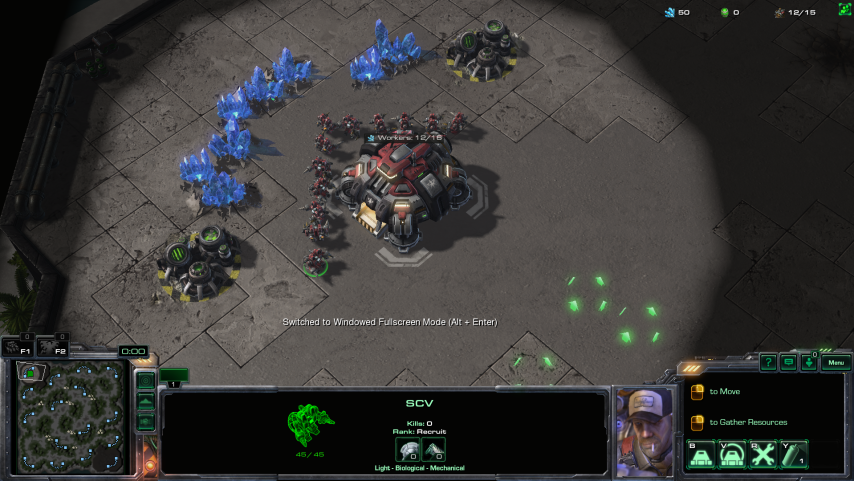
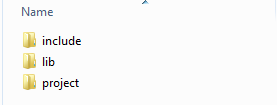
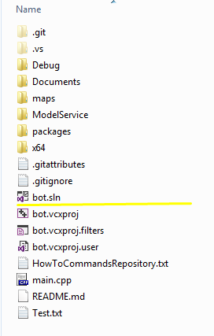
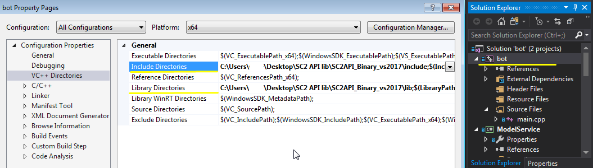

KoKeKoKo
===========================================================
A simple StarCraft II: Wings of Liberty Artificial Intelligence Bot.
KoKeKoKo Bot uses Monte Carlo Tree Search (MCTS) algorithm and Partial-Observable
Markov Decision Process (POMDP) algorithm to generate actions that will be executed
in the environment - StarCraft II: Wings of Liberty in kMapBelShirVestigeLE.  

Directories/Files
-----------------------------------------------------------
- **Documents**: Contains the data for debugging, training, and testing. It also includes
				 other files such as images, documents, and other related document files
				 to this project.
- **ModelService**: Contains the C# executable file. This executable file contains the
					implementation for artificial intelligence, including the connection
					to REngine.
- **maps**: Contains the usable maps for StarCraft II: Wings of Liberty. It is included 
			from the precompiled libs of s2client-api.
- **main.cpp**: Contains the implementation for the bot that directly interacts with the 
				environment. It is included from the precompiled libs of s2client-api.

How to Setup
-----------------------------------------------------------
1. Download the precompiled libs from [s2client-api](https://github.com/Blizzard/s2client-api).
   Alternatively, you can download it directly here: [Precompiled Libs](http://blzdistsc2-a.akamaihd.net/SC2API_Binary_vs2017.zip).
2. After downloading the precompiled libs, extract it and you'll see a folder named *SC2API_Binary_vs2017*.
   Inside of the folder, go to the project folder, and delete all the contents.

3. After deleting all the contents of the project folder, clone this project inside of the folder.
   When you have cloned the github repository, open the project by *bot.sln* file using your Visual Studio.

4. After opening the project solution, setup your precompiled libs by going to the properties of bot
   solution. In the VC++ Directories, set your *Include Directories* and *Library Directories* to the path
   of your *include* folder and *lib* folder from precompiled libs respectively.

5. With the precompiled libs linked to the project solution, one last thing to do is to make the *ModelService* solution work. For this,
   it requires the R software, which you can get at their [CRAN website](https://cran.r-project.org/bin/windows/base/).

6. After installing the R software, you are ready to build the whole project. When it is your first time running the 
   bot, the R software will give a pop-up a few times to install the necessary libraries for the model.

Other Information
-----------------------------------------------------------
For more information in compilation, documentation, and other concerns related to StarCraft II: Wings of Liberty bot, you may check the 
github repository of the api by going here: [s2client-api](https://github.com/Blizzard/s2client-api)

For more information in R, you may check the github repository of the library by going here: [rdotnet](https://github.com/rdotnet/rdotnet)